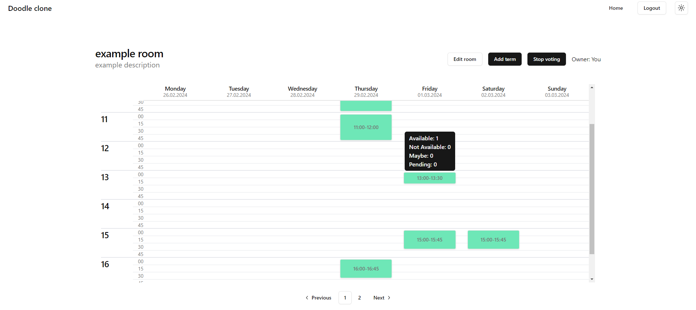
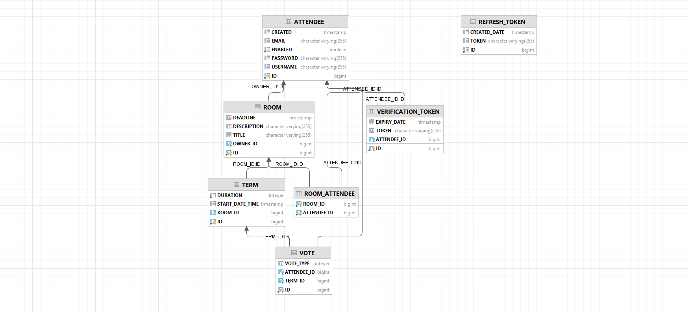

# Doodle clone

## Description

A clone of [doodle](https://doodle.com) - an application used for scheduling meetings.

Doodle is an online scheduling tool that simplifies the process of arranging meetings and events. It allows users to create polls or surveys with proposed dates and times, which participants can then respond to by indicating their availability. This eliminates the need for lengthy email chains or phone calls to coordinate schedules, making it easier to find a mutually convenient time for everyone involved.

[YouTube preview](https://www.youtube.com/watch?v=4862wCIsSQg)


## Technologies
- Java 17
- Spring
- JUnit
- H2
- TypeScript
- React
- Tailwind CSS


## Database schema


## Setup
- Server
    ```
    cd server
    ./gradlew build
    ./gradlew bootRun
    ```
- Client
    
    Requirements: Node: v20.10.0 or newer. Ensure that the server address (especially the port) in the src/lib/data.ts file is correct.
    ```
    cd client
    npm install
    npm run dev
    ```
## Authors
*Bartosz Pawłowski,*
*Krzysztof Wysocki,*
*Jakub Żywiecki,*
*Dominik Pilipczuk,*


